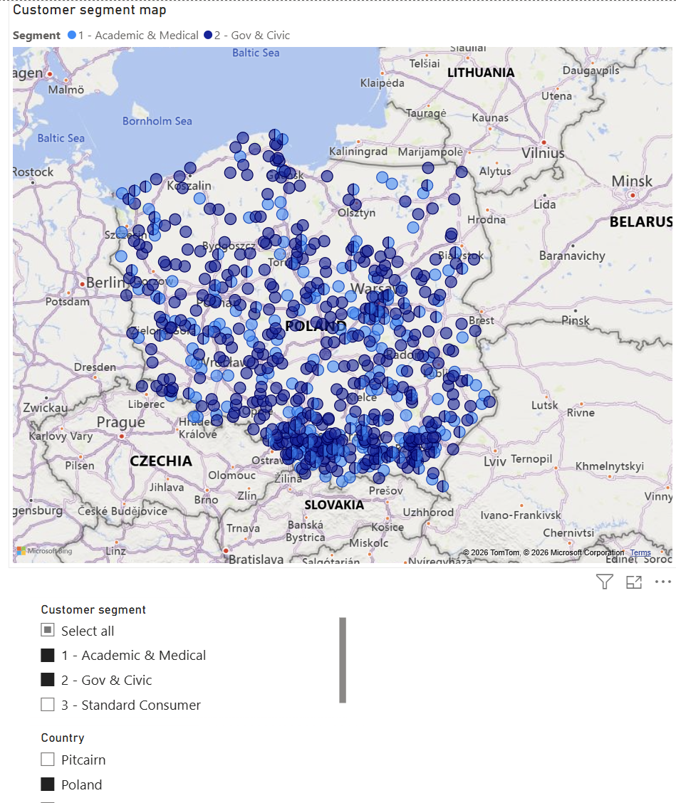
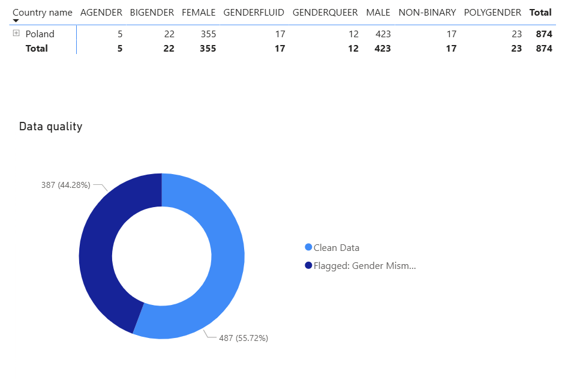

# EDA [Customer demographics pipeline]
End-to-end SQL pipeline and EDA dashboard for customer demographics

## Project Objective
Engineered a secure, multi-tier SQL data pipeline to ingest, clean, and standardize 50,000+ raw demographic records, establishing a clean, centralized foundation for a regional Exploratory Data Analysis (EDA) and demographic segmentation in Power BI.

## Tech Stack
* **Database & Transformation:** SQL (BigQuery)
* **Visualization:** Power BI
* **Techniques:** PII Cryptographic Hashing, Window Functions, Geospatial Validation, Anomaly Detection

## Pipeline Architecture
1. **Raw Data:** Unstandardized text, missing demographic variables, and unhashed PII.
2. **Staging Layer (Data Cleaning & Security):** Standardized casing (`TRIM(LOWER())`), validated geospatial coordinates (removing "Null Island" artifacts), and secured user identities using deterministic one-way hashing (`FARM_FINGERPRINT`).
3. **Data Mart (Business Logic):** Engineered custom categories utilizing robust `CASE WHEN` bounding logic (`>=`, `<=`) to segment VIPs and isolate data quality anomalies (e.g., Title/Gender mismatch detection).
4. **BI & Analytics Layer:** Replaced computationally expensive `JOIN` operations with set-based Window Functions (`OVER(PARTITION BY)`) to calculate regional part-to-whole percentages in a single database pass before exporting to BI tools.

## 📈 Dashboard Previews
*(Geographic and demographic distribution in Poland)*

## 💻 Code Architecture
Feel free to explore the `/sql_pipeline` folder to see the step-by-step SQL logic:
* [1. Staging Layer (Cleaning & Hashing)](./sql_pipeline/01_staging_layer.sql)
* [2. Data Mart Logic (Feature Engineering)](./sql_pipeline/02_data_mart_logic.sql)
* [3. Data Quality Audit (Subqueries)](./sql_pipeline/03_data_quality_audit.sql)
* [4. Demographic Percentages (Window Functions)](./sql_pipeline/04_demographic_percentages.sql)
* [5. Target Markets EDA (Aggregations)](./sql_pipeline/05_target_markets_eda.sql)
